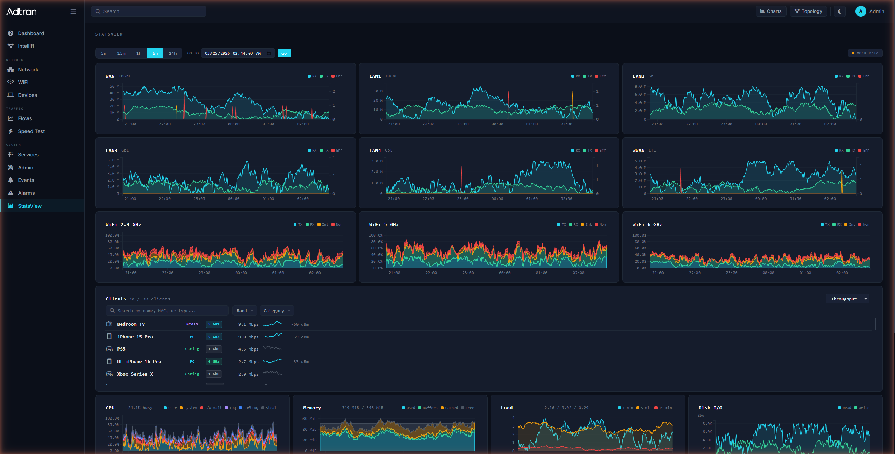
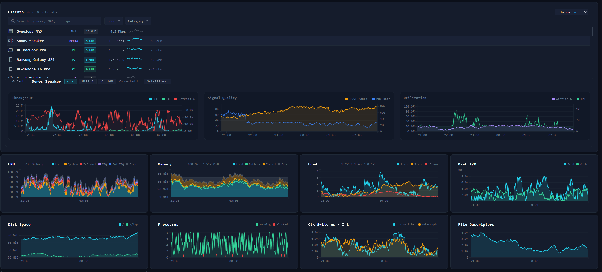

# StatsView

A real-time system and network statistics dashboard for SmartOS residential gateways. A purpose-built interface integrated into the SmartOS JUCI Dashboard. Built as vanilla HTML/CSS/JS with no build step.





## Features

### Interface Stats
- **Per-interface throughput charts** with RX/TX area fills, dual Y-axis for errors/drops, and grab-to-pan across 24h of history
- **Six interface support** including WAN (10GbE), LAN1-LAN4 (GbE/10GbE), and WWAN (LTE) with live rate summaries
- **Time range selector** with 5m, 15m, 1h, 6h, and 24h zoom levels with second-precision labels at short ranges

### Wi-Fi Airtime
- **Per-radio airtime utilization** for 2.4 GHz, 5 GHz, and 6 GHz bands
- **Stacked area breakdown** showing TX, RX, WiFi interference, and non-WiFi interference
- **Live metadata** displaying channel, client count, and total utilization percentage

### System Metrics (Advanced)
- **CPU** with per-state breakdown (user, system, I/O wait, IRQ, softIRQ, steal)
- **Memory** with used/buffers/cached/free stacked area
- **Load average** with 1m, 5m, 15m traces
- **Disk I/O** with read/write throughput
- **Disk space**, **processes**, **context switches/interrupts**, and **file descriptors** as historic line graphs

### Client Monitoring
- **Per-client throughput charts** for both WiFi and wired clients with individual drilldown
- **Device classification** with IoT/streaming/mobile/gaming/desktop badges and device type icons
- **Search and filter** with autocomplete matching on hostname, MAC, IP, or device type
- **Sort options** for airtime utilization, real-time throughput, and daily throughput counters
- **Signal strength indicators** (RSSI) with color-coded badges for WiFi clients
- **Connection details** showing band, channel, PHY rate, and MCS on drilldown

### Dashboard Integration
- **Integrated into SmartOS JUCI Dashboard** as a sidebar page (not a standalone app)
- **Drag-and-drop card reordering** with long-press to enter edit mode (Advanced view)
- **Add/remove cards** with tile picker and "Restore Default Layout" option
- **Section-grouped layout** with Interface Stats, Wi-Fi Airtime, System, and System Internals sections
- **Grab-to-pan** on all chart timelines for scrolling through 24h of buffered history

## Architecture

Integrated into the SmartOS JUCI Dashboard as two files:

| File | Purpose |
|------|---------|
| `statsview.js` | Chart rendering (D3-style SVG), card management, drag-drop, client drilldown, pan/zoom |
| `statsview-data.js` | Data abstraction layer: tries Netdata REST API on port 19999, falls back to mock engine |

### Data Flow

1. `statsview-data.js` probes `http://<host>:19999/api/v1/info` on init
2. If Netdata responds, switches to **live mode** and fetches from Netdata REST API
3. If unreachable, switches to **mock mode** with a built-in 24h synthetic data engine
4. `statsview.js` polls every 2s, appending new data to a circular 24h buffer per chart
5. SVG charts render a viewport window based on the selected time range, with grab-to-pan navigation

### Netdata REST API Endpoints Used

| Endpoint | Purpose |
|----------|---------|
| `/api/v1/info` | Version, hostname, OS, core count, RAM |
| `/api/v1/charts` | Chart catalog for dynamic interface/disk discovery |
| `/api/v1/data?chart=<id>&after=-<secs>&points=<n>` | Time-series data for any chart |

### Key Chart IDs

| Chart ID | Data |
|----------|------|
| `system.cpu` | Per-state CPU utilization |
| `system.ram` | Memory breakdown |
| `system.load` | Load averages |
| `net.<iface>` | Per-interface throughput + errors |
| `disk.<dev>` | Disk I/O |
| `disk_space.<mount>` | Disk usage |
| `system.processes` | Running/blocked process counts |
| `system.ctxt` / `system.intr` | Context switches and interrupts |
| `system.fds` | File descriptor allocation |

## Tech Stack

- Vanilla HTML5 / CSS3 / ES6 JavaScript (no build step, no framework)
- D3-style SVG chart rendering (no D3 dependency, pure `createElementNS`)
- Font Awesome 6 (CDN) for icons
- JetBrains Mono + Inter fonts (CDN)
- CSS Grid + Flexbox layout
- CSS custom properties for dark/light theming
- localStorage for layout persistence and view preferences

## Running Locally

Serve the SmartOS Dashboard directory on any static HTTP server:

```bash
# Using Bun
bunx serve -l 8080

# Using Python
python3 -m http.server 8080
```

Navigate to `http://localhost:8080`, then click **StatsView** in the sidebar. Mock data loads automatically when Netdata is not reachable on port 19999.

## File Structure

```
SmartOS WebUI Homepage/
  index.html            # Dashboard shell (sidebar, page routing)
  styles.css            # All dashboard + StatsView CSS
  statsview.js          # StatsView page logic + charts
  statsview-data.js     # Data layer (Netdata API + mock engine)
  app.js                # Dashboard core (cards, drag-drop, routing)
```

## Related Projects

- [JUCI Dashboard](https://github.com/dlac101/JUCI-dashboard) - SmartOS WebUI Homepage (parent project)
- [FlowSight](https://github.com/dlac101/FlowSight) - Network flow visualization
- [Topology GUI](https://github.com/dlac101/Topology) - Mesh network topology map
